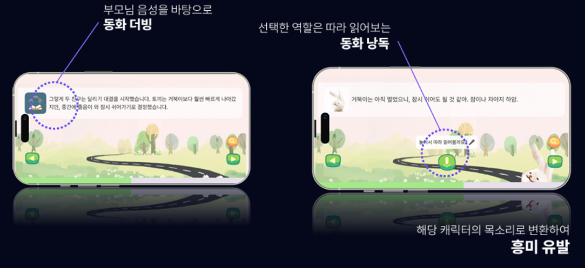
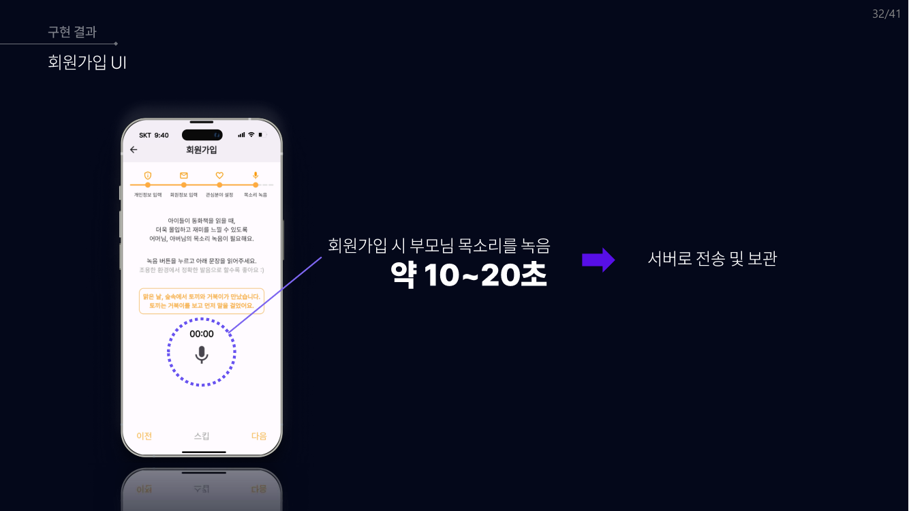
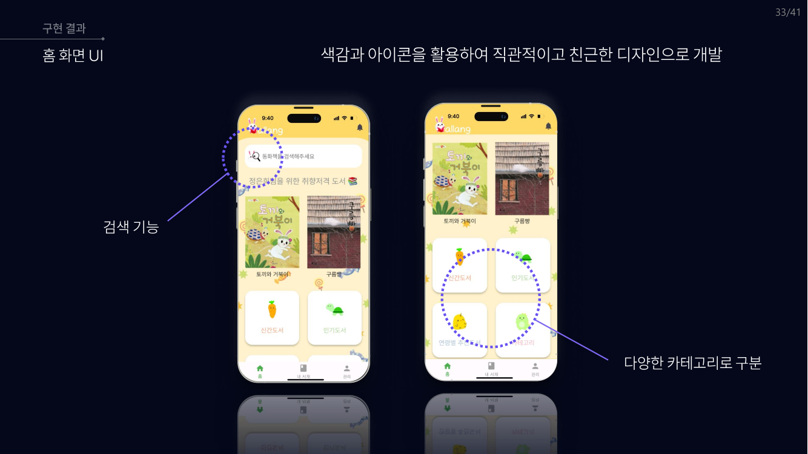
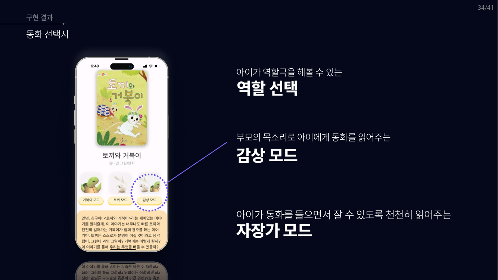
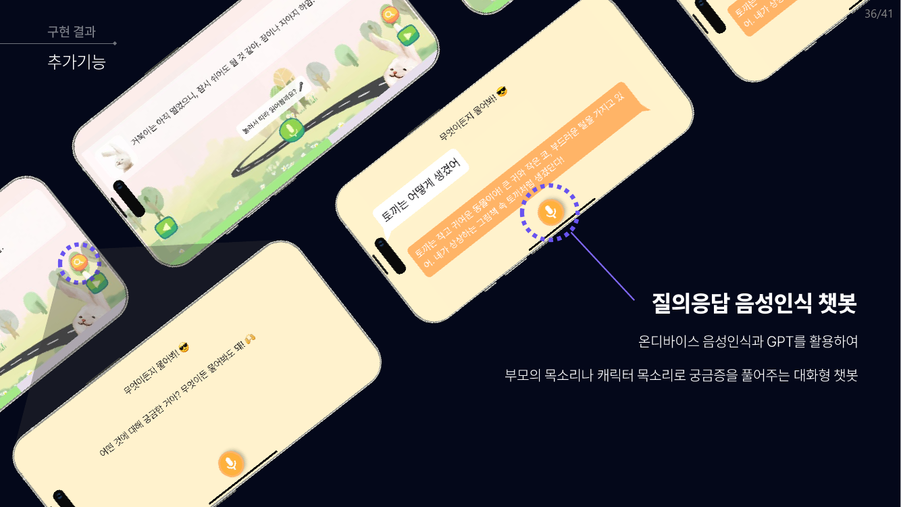
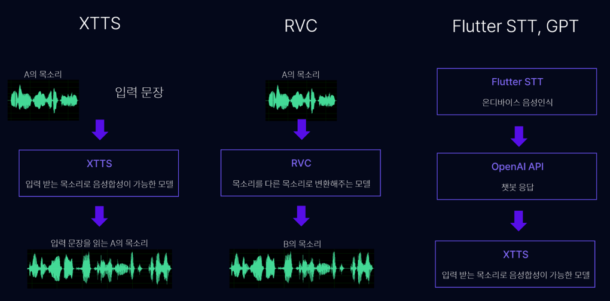
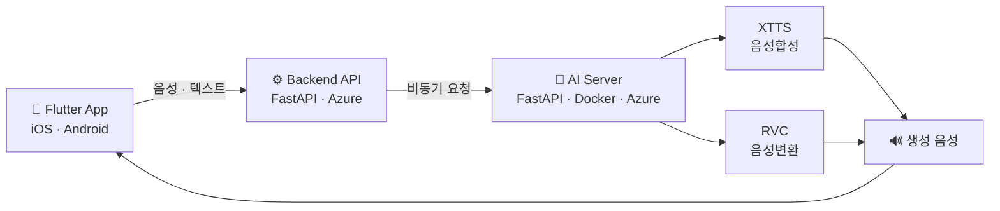

<div align="center">

# 🐰 말랑 (Mallang)

### 부모님 목소리로 읽어주는 AI 동화 낭독 서비스

**10~20초 녹음 한 번이면, 아이는 언제든 부모님 목소리로 동화를 들을 수 있습니다.**




</div>

---

## 📖 어떤 문제를 풀었나

학부모 1,342명 설문에서 드러난 **책 읽어주기의 고충 3가지**입니다.

| | 고충 | 조사 결과 |
|:--:|---|---|
| 😮‍💨 | **EFFORT** — 반복해서 읽어주기가 육체적으로 힘들다 | 책 읽어주기 고민 **1위 (38%)** |
| ⏰ | **TIME** — 맞벌이라 읽어줄 시간이 없다 | 읽어주는 시간대 **자기 전 86%** |
| 🥱 | **FUN** — 부모 목소리가 아니면 아이가 집중하지 않는다 | 영유아는 한 놀이에 오래 집중하지 못함 |

> 출처: 한솔교육, 자녀 평균 연령 5.3세 학부모 1,342명 설문조사 (2020)
> 배경 연구: *Neural circuits underlying mother's voice perception predict social communication abilities in children* (2019)

### 기존 서비스는 왜 실패했나

시장에 있던 유사 서비스는 대부분 **종료**되었습니다. 원인은 명확했습니다.

| 서비스 | 요구 조건 | 현황 |
|---|---|---|
| 아이런 「아빠의 동화 태교」 | 동화 2권 전체 녹음 | 2022년 업데이트 종료 |
| KT 「P-TTS, 내 목소리 동화」 | **300문장** 녹음 | 2019년 베타 종료 |
| KT 「마이 AI 보이스」 | 30문장 녹음 + 생성당 **10만원 이상** | 운영 중 |

**긴 녹음 시간이 진입장벽**이었고, **사용자마다 개인화 TTS 모델을 따로 만드는 구조**가 유지관리 비용을 감당하지 못하게 만들었습니다.

### 말랑의 해법

```
기존:  300문장 녹음 (약 1시간)  →  사용자별 개인 TTS 모델 학습  →  높은 단가
말랑:  10~20초 녹음            →  단일 XTTS 모델로 화자 클로닝  →  구독형 서비스
```

---

## ✨ 주요 기능

<table>
<tr>
<td width="50%">

**🎙️ 회원가입 시 10~20초 녹음**



제시 문장을 읽는 것만으로 화자 임베딩 확보

</td>
<td width="50%">

**📚 취향·연령별 동화 서재**



검색 · 신간 · 인기 · 연령별 카테고리

</td>
</tr>
<tr>
<td width="50%">

**🎭 3가지 감상 모드**



`감상 모드` 부모 목소리로 전체 낭독<br>
`역할 모드` 아이가 한 배역을 맡아 역할극<br>
`자장가 모드` 잠들 수 있도록 천천히 낭독

</td>
<td width="50%">

**💬 음성 질의응답 챗봇**



온디바이스 STT + LLM 응답을<br>부모님·캐릭터 목소리로 재생

</td>
</tr>
</table>

동화 대본은 배역이 구분된 JSON으로 관리되어, **나레이션·토끼·거북이가 각각 다른 목소리**로 재생됩니다.

```json
{
  "title": "토끼와 거북이",
  "charactor": ["나레이션", "토끼", "거북이"],
  "script": [
    { "id": 0, "role": 0, "text": "맑은 날, 숲속에서 토끼와 거북이가 만났습니다." },
    { "id": 1, "role": 1, "text": "하하, 거북이야, 너는 왜 그리 느리게 걸어?" }
  ]
}
```

---

## 🧠 AI 파이프라인

<div align="center">

</div>

| 모델 | 역할 | 활용 |
|---|---|---|
| **XTTS** | 입력받은 음성으로 문장을 읽어주는 음성합성 | 부모님 목소리로 동화 더빙 |
| **RVC** | A의 목소리를 B의 목소리로 변환 | 아이 목소리 → 동화 속 캐릭터 목소리 |
| **STT + LLM** | 온디바이스 음성인식 후 대화형 응답 | 동화 관련 질의응답 챗봇 |

### 시스템 구조



---

## 🎯 기술적 성과

개발 과정에서 마주친 세 가지 병목과 해결 과정입니다.

### 1. 음성 품질 — 짧은 녹음으로 자연스러운 합성이 되는가

10~20초라는 짧은 입력만으로는 녹음 목소리와의 유사도와 억양이 부족했습니다.

- **데이터 증강**으로 입력 오디오 전처리 보강
- **1,013시간 한국어 낭독 데이터**로 XTTS 파인튜닝 (6일 학습)

### 2. 지연 시간 — 동화 한 권 생성이 너무 느리다

문장 단위 추론이 누적되면서 동화 전체 생성에 수십 초가 걸렸습니다.

| 항목 | 개선 전 | 개선 후 | 방법 |
|---|:--:|:--:|---|
| RVC 문장당 추론 | 4초 | **1초 미만** | 불필요한 모델 로드 시간 제거 + 모델 경량화 |
| 서버 처리 | Flask (동기) | **FastAPI (비동기)** | 비동기화 및 병렬 처리로 병목 해소 |
| XTTS 문장당 추론 | 8초 | 8초 | 병렬 처리로 체감 대기시간 단축 |

### 3. 운영 비용 — 사용자마다 모델을 만들 수는 없다

기존 개인화 TTS는 사용자 수만큼 모델을 학습·보관해야 했습니다.

> **하나의 XTTS 모델로 여러 화자를 생성**하도록 설계해, 서버에 저장된 음성 샘플만 교체하면 되는 구조를 만들었습니다. 사용자별 모델 학습·유지관리 비용이 사라졌습니다.

### 그 외 해결한 이슈

- **크로스플랫폼 오디오 코덱** — iOS/Android 공통 지원 포맷인 `.aac`로 통일
- **RVC 노이즈 민감도** — 입력 오디오 노이즈 제거 전처리 추가
- **이성(異性) 간 음높이 문제** — 성별·피치 추론 파라미터 자동 조절

---

## 🛠 기술 스택

| 영역 | 사용 기술 |
|---|---|
| **Frontend** | Flutter (Dart), flutter_sound, permission_handler |
| **Backend** | FastAPI, Uvicorn, Docker, Azure |
| **음성합성** | Coqui XTTS (파인튜닝), PyTorch |
| **음성변환** | RVC (Retrieval-based Voice Conversion) |
| **음성인식** | Whisper, 온디바이스 STT |
| **대화** | OpenAI API |

---

## 📂 프로젝트 구조

```
mallang/
├── lib/                    # Flutter 앱 소스
│   ├── MainPage.dart           # 메인 · 서재 · 카테고리
│   ├── stt.dart                # 음성 인식 및 낭독 채점
│   ├── CombinedPage.dart       # 동화 재생 화면
│   └── Widget/                 # 재사용 UI 컴포넌트
├── tts_test/               # XTTS 음성합성
│   ├── main.py                 # FastAPI 서버 (/tts, /stt)
│   ├── mallang_xtts.py         # XTTS 추론
│   ├── xtts_trainer.py         # XTTS 파인튜닝
│   ├── audio_agumentation.py   # 데이터 증강
│   └── make_dataset*.py        # 학습 데이터셋 구축
├── VCwithRVC/              # RVC 음성변환 서버 · 클라이언트
├── stt/                    # Whisper 파인튜닝 및 발음 채점
│   ├── app.py                  # STT 서버
│   ├── wer_test.py             # WER 기반 채점 로직
│   └── trainer/                # Whisper 학습 코드
├── backend/                # 동화 콘텐츠 (대본 JSON · 삽화 · 음성)
├── preprocessing/          # 오디오 전처리
└── Dockerfile
```

---

## 🚀 실행 방법

### AI 서버 (Docker)

```bash
docker build -t mallang-ai .
docker run --gpus all -p 80:80 mallang-ai
```

### AI 서버 (로컬)

```bash
pip install -r requirements.txt
uvicorn tts_test.main:app --host 0.0.0.0 --port 8000
```

| 엔드포인트 | 메서드 | 설명 |
|---|:--:|---|
| `/tts` | POST | 화자 음성(`wav`) + 문장(`text`) → 합성 음성 반환 |
| `/stt` | POST | 음성(`wav`) → 인식 결과 및 발음 채점 |

### Flutter 앱

```bash
flutter pub get
flutter run
```

> ⚠️ 앱 코드의 API 주소는 프로젝트 당시 Azure 데모 서버를 가리킵니다. **현재 데모 서버는 운영 종료** 상태이므로, 직접 실행하려면 `lib/` 내 서버 주소를 본인 환경으로 변경해야 합니다.
> 학습된 XTTS 가중치(`model/model.pth` 등)는 용량 문제로 저장소에 포함되어 있지 않습니다.

---

## 👥 팀 & 담당 역할

**열정4조** — 프론트엔드 · 백엔드 · AI 파트로 구성된 팀 프로젝트

**이승재 — AI (음성합성) · 서버**

- Coqui XTTS 한국어 파인튜닝 — 1,013시간 낭독 데이터, 데이터 증강 전처리 설계
- 단일 모델 다화자 구조 설계로 사용자별 개인화 모델 학습 비용 제거
- FastAPI 기반 TTS/STT **API 서버 구축** 및 Flask → FastAPI 전환을 통한 비동기 처리
- **Docker 컨테이너화 및 Azure 배포**

---

<div align="center">

**아이와 부모가 즐거워지는 동화낭독 서비스, 말랑**

*육아 부담 완화 · 소통의 가치 · 교육적 가치*

</div>
